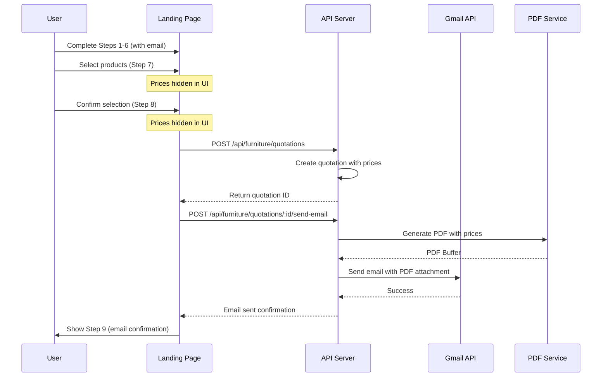

# Design Document: Furniture Quotation Email

## Overview

Tính năng này thay đổi flow báo giá nội thất để bảo vệ thông tin giá và ngăn chặn spam. Thay vì hiển thị giá trực tiếp, hệ thống sẽ gửi PDF báo giá qua email sử dụng Google OAuth2 integration.

### Key Changes
1. **Rate Limiting Optimization**: Tăng giới hạn cho read operations, chỉ áp dụng strict rate limiting cho submission
2. **Hide Prices (Steps 7-8)**: Ẩn tất cả thông tin giá trong UI
3. **Email Delivery (Step 9)**: Gửi PDF qua email thay vì hiển thị trên web
4. **Email Requirement**: Yêu cầu email hợp lệ ở Step 6

## Architecture



## Components and Interfaces

### 1. Rate Limiter Configuration

```typescript
// api/src/middleware/rate-limiter.ts

// Existing rate limiter with new configuration
interface RateLimiterConfig {
  // Read operations - higher limit
  furnitureRead: {
    maxAttempts: 100,  // Increased from default
    windowMs: 60 * 1000,  // 1 minute
  },
  // Quotation submission - moderate limit
  furnitureSubmit: {
    maxAttempts: 10,
    windowMs: 60 * 1000,
  },
  // Email sending - strict limit per quotation
  furnitureEmail: {
    maxAttempts: 3,
    windowMs: 60 * 60 * 1000,  // 1 hour
  },
}
```

### 2. Gmail Email Service

```typescript
// api/src/services/gmail-email.service.ts

interface GmailEmailService {
  /**
   * Send email with PDF attachment using Google OAuth2
   */
  sendQuotationEmail(params: {
    to: string;
    subject: string;
    htmlContent: string;
    pdfBuffer: Buffer;
    pdfFilename: string;
  }): Promise<{ success: boolean; messageId?: string; error?: string }>;

  /**
   * Check if Gmail integration is configured
   */
  isConfigured(): Promise<boolean>;

  /**
   * Refresh OAuth2 token if expired
   */
  refreshTokenIfNeeded(): Promise<void>;
}
```

### 3. Updated Furniture Routes

```typescript
// api/src/routes/furniture.routes.ts

// New endpoint for sending quotation email
app.post('/quotations/:id/send-email', 
  rateLimiter({ maxAttempts: 3, windowMs: 60 * 60 * 1000 }),
  async (c) => {
    // 1. Validate quotation exists
    // 2. Validate lead has email
    // 3. Generate PDF
    // 4. Send email via Gmail API
    // 5. Return success/error
  }
);
```

### 4. Frontend Components Updates

#### LeadInfoStep (Step 6)
- Make email field required
- Add validation for email format
- Show message explaining email is needed for quotation

#### ProductStep (Step 7)
- Remove all price displays
- Remove price range display
- Remove formatCurrency calls for prices
- Keep product names, materials, and images

#### ConfirmationStep (Step 8)
- Remove all price displays
- Remove subtotal, fees, and grand total
- Keep product list with names and quantities
- Update button text to "Xác nhận & Gửi báo giá qua Email"

#### QuotationResultStep (Step 9)
- Replace price display with email confirmation
- Show recipient email address
- Add "Check spam folder" instruction
- Add "Resend email" button
- Add "Request new quotation" button

## Data Models

### Email Send Record (Optional - for tracking)

```typescript
interface QuotationEmailRecord {
  id: string;
  quotationId: string;
  recipientEmail: string;
  sentAt: Date;
  status: 'SENT' | 'FAILED' | 'PENDING';
  errorMessage?: string;
  messageId?: string;  // Gmail message ID
}
```

### API Response Types

```typescript
interface SendEmailResponse {
  success: boolean;
  sentAt?: string;  // ISO timestamp
  recipientEmail?: string;
  error?: {
    code: string;
    message: string;
  };
}
```

## Correctness Properties

*A property is a characteristic or behavior that should hold true across all valid executions of a system-essentially, a formal statement about what the system should do. Properties serve as the bridge between human-readable specifications and machine-verifiable correctness guarantees.*

### Property 1: Price Information Hidden in Steps 7-8
*For any* product selection in Steps 7 and 8, the rendered UI output SHALL NOT contain any price values, currency symbols, or price-related text (e.g., "đ", "VNĐ", formatCurrency output).
**Validates: Requirements 2.1, 2.2, 2.3, 2.4**

### Property 2: Email Validation Prevents Invalid Submissions
*For any* email input string, if the string does not match standard email format (contains @ and valid domain), the system SHALL prevent progression to Step 7.
**Validates: Requirements 4.1, 4.2, 4.3**

### Property 3: Step 9 Shows Email Confirmation
*For any* successful quotation submission, Step 9 SHALL display the recipient email address and NOT display any price information.
**Validates: Requirements 5.1, 5.2**

### Property 4: PDF Contains Complete Quotation Information
*For any* generated PDF, the document SHALL contain: all selected products with prices, apartment information (developer, project, building, unit), fee breakdowns, and total price.
**Validates: Requirements 7.1, 7.2, 7.3**

### Property 5: Email Filename Format
*For any* quotation email attachment, the PDF filename SHALL match the pattern "bao-gia-{unitNumber}-{date}.pdf" where date is in YYYY-MM-DD format.
**Validates: Requirements 7.4**

### Property 6: API Validates Quotation Before Email
*For any* email send request, if the quotation ID does not exist or the associated lead has no email, the API SHALL return an error response.
**Validates: Requirements 8.2**

### Property 7: Email Rate Limiting Per Quotation
*For any* quotation, the system SHALL allow at most 3 email send requests per hour. Subsequent requests SHALL return a rate limit error.
**Validates: Requirements 8.5**

### Property 8: Read Operations Rate Limit
*For any* sequence of read operations (GET requests to furniture endpoints), the system SHALL allow at least 50 requests per minute without rate limiting.
**Validates: Requirements 1.1, 1.4**

## Error Handling

### Error Codes

| Code | HTTP Status | Description |
|------|-------------|-------------|
| `QUOTATION_NOT_FOUND` | 404 | Quotation ID does not exist |
| `LEAD_EMAIL_MISSING` | 400 | Lead associated with quotation has no email |
| `GMAIL_NOT_CONFIGURED` | 503 | Google integration not set up in admin |
| `GMAIL_TOKEN_EXPIRED` | 503 | OAuth2 token expired and refresh failed |
| `EMAIL_SEND_FAILED` | 500 | Gmail API returned error |
| `EMAIL_RATE_LIMITED` | 429 | Too many email requests for this quotation |

### Error Response Format

```typescript
{
  success: false,
  error: {
    code: 'GMAIL_NOT_CONFIGURED',
    message: 'Vui lòng cấu hình Google integration trong Admin Settings',
    retryAfter?: number  // For rate limit errors
  }
}
```

## Testing Strategy

### Unit Tests
- Email validation function with various input formats
- PDF filename generation with different unit numbers and dates
- Rate limiter configuration verification

### Property-Based Tests
- **Property 1**: Generate random product selections, render UI, verify no price patterns in output
- **Property 2**: Generate random strings, verify email validation correctly accepts/rejects
- **Property 5**: Generate random quotations, verify filename format matches pattern
- **Property 6**: Generate random quotation IDs, verify validation behavior
- **Property 7**: Simulate multiple email requests, verify rate limiting kicks in after 3
- **Property 8**: Simulate read request sequences, verify no rate limiting under 50/min

### Integration Tests
- End-to-end flow from Step 6 to email delivery
- Gmail API integration with mock server
- Error handling for various failure scenarios

### Testing Framework
- Use **fast-check** for property-based testing in TypeScript
- Minimum 100 iterations per property test
- Each property test tagged with: `**Feature: furniture-quotation-email, Property {number}: {property_text}**`

