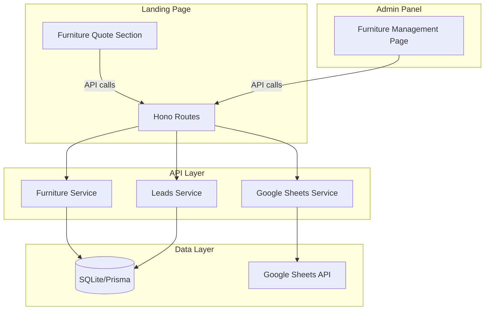

# Design Document: Furniture Quotation System

## Overview

Hệ thống Báo giá Nội thất là một module mở rộng cho ứng dụng ANH THỢ XÂY, cho phép:
- **Landing page**: Khách hàng chọn căn hộ qua quy trình step-by-step và nhận báo giá nội thất
- **Admin panel**: Quản lý dữ liệu dự án, sản phẩm nội thất, combo, phí và đồng bộ Google Sheets

Hệ thống tận dụng các services và patterns đã có trong codebase hiện tại.

## Architecture

### High-Level Architecture



### Module Structure

```
api/src/
├── routes/
│   └── furniture.routes.ts          # All furniture API endpoints (follow pricing.routes.ts pattern)
├── services/
│   └── furniture.service.ts         # Business logic (follow pricing.service.ts pattern)
├── schemas/
│   └── furniture.schema.ts          # Zod validation schemas

admin/src/app/
├── pages/
│   └── FurniturePage/
│       ├── index.tsx                # Main page with ResponsiveTabs (follow PricingConfigPage pattern)
│       ├── ManagementTab.tsx        # Project data management
│       ├── CatalogTab.tsx           # Products & categories
│       ├── ComboTab.tsx             # Combo management
│       ├── SettingsTab.tsx          # Fees configuration
│       └── types.ts                 # TypeScript types for this page
├── api/
│   └── furniture.ts                 # API client functions (follow content.ts pattern)

landing/src/app/
├── sections/
│   └── FurnitureQuote/
│       ├── index.tsx                # Main section component
│       ├── StepSelector.tsx         # Steps 1-4: Select apartment
│       ├── LayoutSelector.tsx       # Step 5: Select layout
│       ├── LeadForm.tsx             # Lead capture form
│       ├── FurnitureSelector.tsx    # Step 6: Combo/Custom
│       └── QuotationResult.tsx      # Step 7: Final quotation
```

### Patterns to Follow

1. **API Routes Pattern** (from `pricing.routes.ts`):
   - Use `createFurnitureRoutes(prisma: PrismaClient)` factory function
   - Use `authenticate()`, `requireRole('ADMIN', 'MANAGER')` for protected routes
   - Use `validate(schema)`, `getValidatedBody<T>(c)` for validation
   - Use `successResponse(c, data)`, `errorResponse(c, code, message, status)` for responses

2. **Admin Page Pattern** (from `PricingConfigPage`):
   - Use `ResponsiveTabs` component for tab navigation
   - Use `tokens` from `@app/shared` for styling
   - Use `motion` from `framer-motion` for animations
   - Fetch all data in parent, pass to child tabs

3. **API Client Pattern** (from `content.ts`):
   - Use `apiFetch<T>(url, options)` for API calls
   - Group related functions in objects (e.g., `furnitureDevelopersApi`, `furnitureProductsApi`)
   - Handle file uploads with `FormData`

## Components and Interfaces

### API Endpoints

#### Public Endpoints (Landing)
```typescript
// Get hierarchical data for selection
GET /api/furniture/developers
GET /api/furniture/projects?developerId={id}
GET /api/furniture/buildings?projectId={id}
GET /api/furniture/layouts?buildingCode={code}
GET /api/furniture/layouts/by-axis?buildingCode={code}&axis={axis}
GET /api/furniture/apartment-types?buildingCode={code}&type={type}

// Get furniture options
GET /api/furniture/combos?apartmentType={type}
GET /api/furniture/products?categoryId={id}
GET /api/furniture/categories

// Get fees
GET /api/furniture/fees?applicability={combo|custom|both}

// Submit quotation (creates lead + quotation)
POST /api/furniture/quotations
```

#### Admin Endpoints (Protected - ADMIN, MANAGER)
```typescript
// CRUD for all entities (follow pricing.routes.ts pattern)
// Developers
GET    /api/admin/furniture/developers
POST   /api/admin/furniture/developers
PUT    /api/admin/furniture/developers/:id
DELETE /api/admin/furniture/developers/:id

// Projects
GET    /api/admin/furniture/projects
POST   /api/admin/furniture/projects
PUT    /api/admin/furniture/projects/:id
DELETE /api/admin/furniture/projects/:id

// Buildings
GET    /api/admin/furniture/buildings
POST   /api/admin/furniture/buildings
PUT    /api/admin/furniture/buildings/:id
DELETE /api/admin/furniture/buildings/:id

// Layouts
GET    /api/admin/furniture/layouts
POST   /api/admin/furniture/layouts
PUT    /api/admin/furniture/layouts/:id
DELETE /api/admin/furniture/layouts/:id

// Apartment Types
GET    /api/admin/furniture/apartment-types
POST   /api/admin/furniture/apartment-types
PUT    /api/admin/furniture/apartment-types/:id
DELETE /api/admin/furniture/apartment-types/:id

// Categories
GET    /api/admin/furniture/categories
POST   /api/admin/furniture/categories
PUT    /api/admin/furniture/categories/:id
DELETE /api/admin/furniture/categories/:id

// Products
GET    /api/admin/furniture/products
POST   /api/admin/furniture/products
PUT    /api/admin/furniture/products/:id
DELETE /api/admin/furniture/products/:id

// Combos
GET    /api/admin/furniture/combos
POST   /api/admin/furniture/combos
PUT    /api/admin/furniture/combos/:id
DELETE /api/admin/furniture/combos/:id
POST   /api/admin/furniture/combos/:id/duplicate

// Fees
GET    /api/admin/furniture/fees
POST   /api/admin/furniture/fees
PUT    /api/admin/furniture/fees/:id
DELETE /api/admin/furniture/fees/:id

// Import/Export CSV
POST /api/admin/furniture/import
GET  /api/admin/furniture/export

// Google Sheets sync (reuse existing googleSheetsService)
POST /api/admin/furniture/sync/pull
POST /api/admin/furniture/sync/push

// Quotation history
GET /api/admin/furniture/quotations?leadId={id}
GET /api/admin/furniture/quotations/:id/pdf
```

### Admin API Client (admin/src/app/api/furniture.ts)

Following the pattern from `content.ts`:

```typescript
import { apiFetch } from './client';
import type {
  FurnitureDeveloper,
  FurnitureProject,
  FurnitureBuilding,
  FurnitureLayout,
  FurnitureApartmentType,
  FurnitureCategory,
  FurnitureProduct,
  FurnitureCombo,
  FurnitureFee,
  FurnitureQuotation,
} from '../types/furniture';

// ========== DEVELOPERS API ==========
export const furnitureDevelopersApi = {
  list: () => apiFetch<FurnitureDeveloper[]>('/admin/furniture/developers'),
  create: (data: { name: string }) =>
    apiFetch<FurnitureDeveloper>('/admin/furniture/developers', { method: 'POST', body: data }),
  update: (id: string, data: { name?: string }) =>
    apiFetch<FurnitureDeveloper>(`/admin/furniture/developers/${id}`, { method: 'PUT', body: data }),
  delete: (id: string) =>
    apiFetch<{ ok: boolean }>(`/admin/furniture/developers/${id}`, { method: 'DELETE' }),
};

// ========== PROJECTS API ==========
export const furnitureProjectsApi = {
  list: (developerId?: string) => {
    const query = developerId ? `?developerId=${developerId}` : '';
    return apiFetch<FurnitureProject[]>(`/admin/furniture/projects${query}`);
  },
  create: (data: { name: string; code: string; developerId: string }) =>
    apiFetch<FurnitureProject>('/admin/furniture/projects', { method: 'POST', body: data }),
  update: (id: string, data: Partial<{ name: string; code: string }>) =>
    apiFetch<FurnitureProject>(`/admin/furniture/projects/${id}`, { method: 'PUT', body: data }),
  delete: (id: string) =>
    apiFetch<{ ok: boolean }>(`/admin/furniture/projects/${id}`, { method: 'DELETE' }),
};

// ========== BUILDINGS API ==========
export const furnitureBuildingsApi = {
  list: (projectId?: string) => {
    const query = projectId ? `?projectId=${projectId}` : '';
    return apiFetch<FurnitureBuilding[]>(`/admin/furniture/buildings${query}`);
  },
  create: (data: { name: string; code: string; projectId: string; maxFloor: number; maxAxis: number }) =>
    apiFetch<FurnitureBuilding>('/admin/furniture/buildings', { method: 'POST', body: data }),
  update: (id: string, data: Partial<{ name: string; code: string; maxFloor: number; maxAxis: number }>) =>
    apiFetch<FurnitureBuilding>(`/admin/furniture/buildings/${id}`, { method: 'PUT', body: data }),
  delete: (id: string) =>
    apiFetch<{ ok: boolean }>(`/admin/furniture/buildings/${id}`, { method: 'DELETE' }),
};

// ... similar patterns for other entities

// ========== IMPORT/EXPORT API ==========
export const furnitureDataApi = {
  import: async (files: { duAn: File; layouts: File; apartmentTypes: File }) => {
    const formData = new FormData();
    formData.append('duAn', files.duAn);
    formData.append('layouts', files.layouts);
    formData.append('apartmentTypes', files.apartmentTypes);
    // Use fetch directly for FormData
    // ...
  },
  export: () => apiFetch<{ duAn: string; layouts: string; apartmentTypes: string }>('/admin/furniture/export'),
  syncPull: (spreadsheetId: string) =>
    apiFetch<{ success: boolean; counts: { developers: number; projects: number; buildings: number; layouts: number; apartmentTypes: number } }>(
      '/admin/furniture/sync/pull',
      { method: 'POST', body: { spreadsheetId } }
    ),
  syncPush: (spreadsheetId: string) =>
    apiFetch<{ success: boolean; counts: { developers: number; projects: number; buildings: number; layouts: number; apartmentTypes: number } }>(
      '/admin/furniture/sync/push',
      { method: 'POST', body: { spreadsheetId } }
    ),
};
```

### Service Interfaces

```typescript
// furniture.service.ts
interface FurnitureService {
  // Developers
  getDevelopers(): Promise<FurnitureDeveloper[]>;
  createDeveloper(data: CreateDeveloperInput): Promise<FurnitureDeveloper>;
  updateDeveloper(id: string, data: UpdateDeveloperInput): Promise<FurnitureDeveloper>;
  deleteDeveloper(id: string): Promise<void>;
  
  // Projects
  getProjects(developerId?: string): Promise<FurnitureProject[]>;
  createProject(data: CreateProjectInput): Promise<FurnitureProject>;
  updateProject(id: string, data: UpdateProjectInput): Promise<FurnitureProject>;
  deleteProject(id: string): Promise<void>;
  
  // Buildings
  getBuildings(projectId?: string): Promise<FurnitureBuilding[]>;
  createBuilding(data: CreateBuildingInput): Promise<FurnitureBuilding>;
  updateBuilding(id: string, data: UpdateBuildingInput): Promise<FurnitureBuilding>;
  deleteBuilding(id: string): Promise<void>;
  
  // Layouts
  getLayouts(buildingCode: string): Promise<FurnitureLayout[]>;
  getLayoutByAxis(buildingCode: string, axis: number): Promise<FurnitureLayout | null>;
  createLayout(data: CreateLayoutInput): Promise<FurnitureLayout>;
  updateLayout(id: string, data: UpdateLayoutInput): Promise<FurnitureLayout>;
  deleteLayout(id: string): Promise<void>;
  
  // Apartment Types
  getApartmentTypes(buildingCode: string, type?: string): Promise<FurnitureApartmentType[]>;
  createApartmentType(data: CreateApartmentTypeInput): Promise<FurnitureApartmentType>;
  updateApartmentType(id: string, data: UpdateApartmentTypeInput): Promise<FurnitureApartmentType>;
  deleteApartmentType(id: string): Promise<void>;
  
  // Categories
  getCategories(): Promise<FurnitureCategory[]>;
  createCategory(data: CreateCategoryInput): Promise<FurnitureCategory>;
  updateCategory(id: string, data: UpdateCategoryInput): Promise<FurnitureCategory>;
  deleteCategory(id: string): Promise<void>;
  
  // Products
  getProducts(categoryId?: string): Promise<FurnitureProduct[]>;
  createProduct(data: CreateProductInput): Promise<FurnitureProduct>;
  updateProduct(id: string, data: UpdateProductInput): Promise<FurnitureProduct>;
  deleteProduct(id: string): Promise<void>;
  
  // Combos
  getCombos(apartmentType?: string): Promise<FurnitureCombo[]>;
  createCombo(data: CreateComboInput): Promise<FurnitureCombo>;
  updateCombo(id: string, data: UpdateComboInput): Promise<FurnitureCombo>;
  deleteCombo(id: string): Promise<void>;
  duplicateCombo(id: string): Promise<FurnitureCombo>;
  
  // Fees
  getFees(applicability?: 'COMBO' | 'CUSTOM' | 'BOTH'): Promise<FurnitureFee[]>;
  createFee(data: CreateFeeInput): Promise<FurnitureFee>;
  updateFee(id: string, data: UpdateFeeInput): Promise<FurnitureFee>;
  deleteFee(id: string): Promise<void>;
  
  // Quotations
  createQuotation(data: CreateQuotationInput): Promise<FurnitureQuotation>;
  getQuotationsByLead(leadId: string): Promise<FurnitureQuotation[]>;
  getQuotationById(id: string): Promise<FurnitureQuotation>;
  
  // Import/Export
  importFromCSV(files: { duAn: string; layouts: string; apartmentTypes: string }): Promise<ImportResult>;
  exportToCSV(): Promise<{ duAn: string; layouts: string; apartmentTypes: string }>;
  
  // Google Sheets Sync
  syncPull(spreadsheetId: string): Promise<SyncResult>;
  syncPush(spreadsheetId: string): Promise<SyncResult>;
  
  // Utility
  calculateUnitNumber(buildingCode: string, floor: number, axis: number): string;
  calculateQuotation(items: QuotationItem[], fees: FurnitureFee[]): QuotationCalculation;
}
```

## Data Models

### Prisma Schema Extensions

```prisma
// ============================================
// FURNITURE QUOTATION SYSTEM
// ============================================

model FurnitureDeveloper {
  id        String   @id @default(cuid())
  name      String   @unique  // ChuDauTu
  
  projects  FurnitureProject[]
  
  createdAt DateTime @default(now())
  updatedAt DateTime @updatedAt
}

model FurnitureProject {
  id          String   @id @default(cuid())
  name        String   // TenDuAn
  code        String   // MaDuAn
  developerId String
  developer   FurnitureDeveloper @relation(fields: [developerId], references: [id], onDelete: Cascade)
  
  buildings   FurnitureBuilding[]
  
  createdAt   DateTime @default(now())
  updatedAt   DateTime @updatedAt
  
  @@unique([developerId, code])
  @@index([developerId])
}

model FurnitureBuilding {
  id          String   @id @default(cuid())
  name        String   // TenToaNha (display name)
  code        String   // MaToaNha (for lookup)
  projectId   String
  project     FurnitureProject @relation(fields: [projectId], references: [id], onDelete: Cascade)
  maxFloor    Int      // SoTangMax
  maxAxis     Int      // SoTrucMax
  
  createdAt   DateTime @default(now())
  updatedAt   DateTime @updatedAt
  
  @@index([projectId])
  @@index([code])
}

model FurnitureLayout {
  id            String   @id @default(cuid())
  layoutAxis    String   @unique  // {MaToaNha}_{SoTruc}
  buildingCode  String   // MaToaNha
  axis          Int      // SoTruc
  apartmentType String   // 1pn, 2pn, 3pn, 1pn+, penhouse, shophouse
  
  createdAt     DateTime @default(now())
  updatedAt     DateTime @updatedAt
  
  @@unique([buildingCode, axis])
  @@index([buildingCode])
  @@index([apartmentType])
}

model FurnitureApartmentType {
  id            String   @id @default(cuid())
  buildingCode  String   // MaToaNha
  apartmentType String   // 1pn, 2pn, etc.
  imageUrl      String?
  description   String?
  
  createdAt     DateTime @default(now())
  updatedAt     DateTime @updatedAt
  
  @@index([buildingCode])
  @@index([apartmentType])
}

model FurnitureCategory {
  id          String   @id @default(cuid())
  name        String   @unique
  description String?
  icon        String?
  order       Int      @default(0)
  isActive    Boolean  @default(true)
  
  products    FurnitureProduct[]
  
  createdAt   DateTime @default(now())
  updatedAt   DateTime @updatedAt
}

model FurnitureProduct {
  id          String   @id @default(cuid())
  name        String
  categoryId  String
  category    FurnitureCategory @relation(fields: [categoryId], references: [id])
  price       Float
  imageUrl    String?
  description String?
  dimensions  String?  // JSON: { width, height, depth }
  order       Int      @default(0)
  isActive    Boolean  @default(true)
  
  comboItems  FurnitureComboItem[]
  
  createdAt   DateTime @default(now())
  updatedAt   DateTime @updatedAt
  
  @@index([categoryId])
  @@index([isActive])
}

model FurnitureCombo {
  id             String   @id @default(cuid())
  name           String
  apartmentTypes String   // JSON array: ["1pn", "2pn"]
  price          Float
  imageUrl       String?
  description    String?
  isActive       Boolean  @default(true)
  
  items          FurnitureComboItem[]
  
  createdAt      DateTime @default(now())
  updatedAt      DateTime @updatedAt
  
  @@index([isActive])
}

model FurnitureComboItem {
  id        String   @id @default(cuid())
  comboId   String
  combo     FurnitureCombo @relation(fields: [comboId], references: [id], onDelete: Cascade)
  productId String
  product   FurnitureProduct @relation(fields: [productId], references: [id])
  quantity  Int      @default(1)
  
  @@unique([comboId, productId])
  @@index([comboId])
  @@index([productId])
}

model FurnitureFee {
  id            String   @id @default(cuid())
  name          String
  type          String   // FIXED, PERCENTAGE
  value         Float
  applicability String   // COMBO, CUSTOM, BOTH
  description   String?
  isActive      Boolean  @default(true)
  order         Int      @default(0)
  
  createdAt     DateTime @default(now())
  updatedAt     DateTime @updatedAt
  
  @@index([applicability])
  @@index([isActive])
}

model FurnitureQuotation {
  id            String   @id @default(cuid())
  leadId        String
  lead          CustomerLead @relation(fields: [leadId], references: [id])
  
  // Apartment info
  developerName String
  projectName   String
  buildingName  String
  buildingCode  String
  floor         Int
  axis          Int
  unitNumber    String   // Calculated: {buildingCode}.{floor}{axis}
  apartmentType String
  layoutImageUrl String?
  
  // Selection
  selectionType String   // COMBO, CUSTOM
  comboId       String?
  comboName     String?
  
  // Items (JSON for flexibility)
  items         String   // JSON: [{ productId, name, price, quantity }]
  
  // Pricing
  basePrice     Float
  fees          String   // JSON: [{ name, type, value, amount }]
  totalPrice    Float
  
  createdAt     DateTime @default(now())
  
  @@index([leadId])
  @@index([createdAt])
}
```

### Relation to Existing Models

```prisma
// Update CustomerLead model to add relation
model CustomerLead {
  // ... existing fields ...
  
  // Add relation to quotations
  furnitureQuotations FurnitureQuotation[]
}
```


## Correctness Properties

*A property is a characteristic or behavior that should hold true across all valid executions of a system-essentially, a formal statement about what the system should do. Properties serve as the bridge between human-readable specifications and machine-verifiable correctness guarantees.*

Based on the prework analysis, the following properties have been identified after eliminating redundancy:

### Property 1: Metrics Grid Dimensions
*For any* building with SoTangMax floors and SoTrucMax axes, the generated metrics grid SHALL have exactly SoTangMax rows and (SoTrucMax + 1) columns.
**Validates: Requirements 1.2**

### Property 2: Layout Lookup Consistency
*For any* valid combination of MaToaNha and SoTruc that exists in LayoutIDs, the lookup function SHALL return the same ApartmentType consistently.
**Validates: Requirements 1.3, 6.6**

### Property 3: CSV Import/Export Round Trip
*For any* valid dataset, exporting to CSV and then importing the same CSV files SHALL produce an equivalent dataset.
**Validates: Requirements 1.6, 1.8**

### Property 4: ApartmentType Normalization
*For any* ApartmentType string with leading/trailing whitespace, the normalization function SHALL produce a trimmed, lowercase string.
**Validates: Requirements 1.7**

### Property 5: Category Deletion Constraint
*For any* category that has associated products, attempting to delete the category SHALL fail with an error.
**Validates: Requirements 2.7**

### Property 6: Combo Duplication
*For any* combo, duplicating it SHALL create a new combo with name "{originalName} (Copy)" and identical properties except for the id.
**Validates: Requirements 3.4**

### Property 7: Fee Calculation Correctness
*For any* set of items and fees, the calculated total SHALL equal: basePrice + sum(applicableFees), where applicableFees are determined by the selectionType (COMBO/CUSTOM) and fee applicability setting.
**Validates: Requirements 4.5, 7.6**

### Property 8: Unit Number Format
*For any* building code, floor number, and axis number, the calculated unit number SHALL match the format: {buildingCode}.{floor padded to 2 digits}{axis padded to 2 digits}.
**Validates: Requirements 6.5**

### Property 9: Invalid Axis Error Handling
*For any* axis value that does not exist in LayoutIDs for the given MaToaNha, the lookup function SHALL return null or throw an error.
**Validates: Requirements 6.7**

### Property 10: Google Sheets Sync Round Trip
*For any* valid dataset, pushing to Google Sheets and then pulling from the same sheet SHALL produce an equivalent dataset.
**Validates: Requirements 9.3, 9.4**

### Property 11: Quotation Data Completeness
*For any* created quotation, the stored record SHALL contain all required fields: developerName, projectName, buildingName, buildingCode, floor, axis, unitNumber, apartmentType, selectionType, items, basePrice, fees, and totalPrice.
**Validates: Requirements 11.2**

## Error Handling

### API Error Responses

All API endpoints follow the existing error response pattern:

```typescript
// Success response
{
  success: true,
  data: { ... }
}

// Error response
{
  success: false,
  error: {
    code: 'ERROR_CODE',
    message: 'Human readable message'
  }
}
```

### Error Codes

| Code | HTTP Status | Description |
|------|-------------|-------------|
| `VALIDATION_ERROR` | 400 | Invalid input data |
| `NOT_FOUND` | 404 | Resource not found |
| `CONFLICT` | 409 | Duplicate or constraint violation |
| `UNAUTHORIZED` | 401 | Not authenticated |
| `FORBIDDEN` | 403 | Not authorized for this action |
| `INTERNAL_ERROR` | 500 | Server error |
| `SYNC_ERROR` | 500 | Google Sheets sync failed |
| `IMPORT_ERROR` | 400 | CSV import validation failed |

### Validation Rules

```typescript
// Building validation
const buildingSchema = z.object({
  name: z.string().min(1).max(100),
  code: z.string().min(1).max(20),
  projectId: z.string().cuid(),
  maxFloor: z.number().int().min(1).max(200),
  maxAxis: z.number().int().min(0).max(100),
});

// Layout validation
const layoutSchema = z.object({
  buildingCode: z.string().min(1).max(20),
  axis: z.number().int().min(0),
  apartmentType: z.string().min(1).max(20).transform(s => s.trim().toLowerCase()),
});

// Product validation
const productSchema = z.object({
  name: z.string().min(1).max(200),
  categoryId: z.string().cuid(),
  price: z.number().positive(),
  imageUrl: z.string().url().optional(),
  description: z.string().max(1000).optional(),
  dimensions: z.string().optional(), // JSON string
});

// Fee validation
const feeSchema = z.object({
  name: z.string().min(1).max(100),
  type: z.enum(['FIXED', 'PERCENTAGE']),
  value: z.number().positive(),
  applicability: z.enum(['COMBO', 'CUSTOM', 'BOTH']),
});

// Quotation validation
const quotationSchema = z.object({
  leadId: z.string().cuid(),
  developerName: z.string().min(1),
  projectName: z.string().min(1),
  buildingName: z.string().min(1),
  buildingCode: z.string().min(1),
  floor: z.number().int().min(1),
  axis: z.number().int().min(0),
  apartmentType: z.string().min(1),
  selectionType: z.enum(['COMBO', 'CUSTOM']),
  comboId: z.string().cuid().optional(),
  items: z.array(z.object({
    productId: z.string().cuid(),
    name: z.string(),
    price: z.number(),
    quantity: z.number().int().positive(),
  })),
});
```

## Testing Strategy

### Dual Testing Approach

The system uses both unit tests and property-based tests for comprehensive coverage:

1. **Unit Tests**: Verify specific examples, edge cases, and integration points
2. **Property-Based Tests**: Verify universal properties that should hold across all inputs

### Property-Based Testing Framework

The project uses **fast-check** for property-based testing in TypeScript.

```typescript
import fc from 'fast-check';
```

### Test File Structure

```
api/src/services/
├── furniture.service.ts
├── furniture.service.test.ts           # Unit tests
└── furniture.service.property.test.ts  # Property-based tests
```

### Property Test Examples

```typescript
// Property 1: Metrics Grid Dimensions
describe('Metrics Grid Generation', () => {
  it('should generate grid with correct dimensions for any valid building', () => {
    fc.assert(
      fc.property(
        fc.integer({ min: 1, max: 100 }), // maxFloor
        fc.integer({ min: 0, max: 50 }),  // maxAxis
        (maxFloor, maxAxis) => {
          const grid = generateMetricsGrid(maxFloor, maxAxis);
          expect(grid.length).toBe(maxFloor);
          expect(grid[0].length).toBe(maxAxis + 1);
        }
      ),
      { numRuns: 100 }
    );
  });
});

// Property 8: Unit Number Format
describe('Unit Number Calculation', () => {
  it('should format unit number correctly for any valid inputs', () => {
    fc.assert(
      fc.property(
        fc.string({ minLength: 1, maxLength: 10 }), // buildingCode
        fc.integer({ min: 1, max: 99 }),            // floor
        fc.integer({ min: 0, max: 99 }),            // axis
        (buildingCode, floor, axis) => {
          const unitNumber = calculateUnitNumber(buildingCode, floor, axis);
          const expected = `${buildingCode}.${floor.toString().padStart(2, '0')}${axis.toString().padStart(2, '0')}`;
          expect(unitNumber).toBe(expected);
        }
      ),
      { numRuns: 100 }
    );
  });
});
```

### Test Annotations

Each property-based test MUST be tagged with a comment referencing the correctness property:

```typescript
/**
 * **Feature: furniture-quotation, Property 7: Fee Calculation Correctness**
 * For any set of items and fees, the calculated total SHALL equal:
 * basePrice + sum(applicableFees)
 */
it('should calculate fees correctly for any valid inputs', () => {
  // ... test implementation
});
```

### Test Configuration

Property-based tests should run a minimum of 100 iterations:

```typescript
fc.assert(property, { numRuns: 100 });
```
