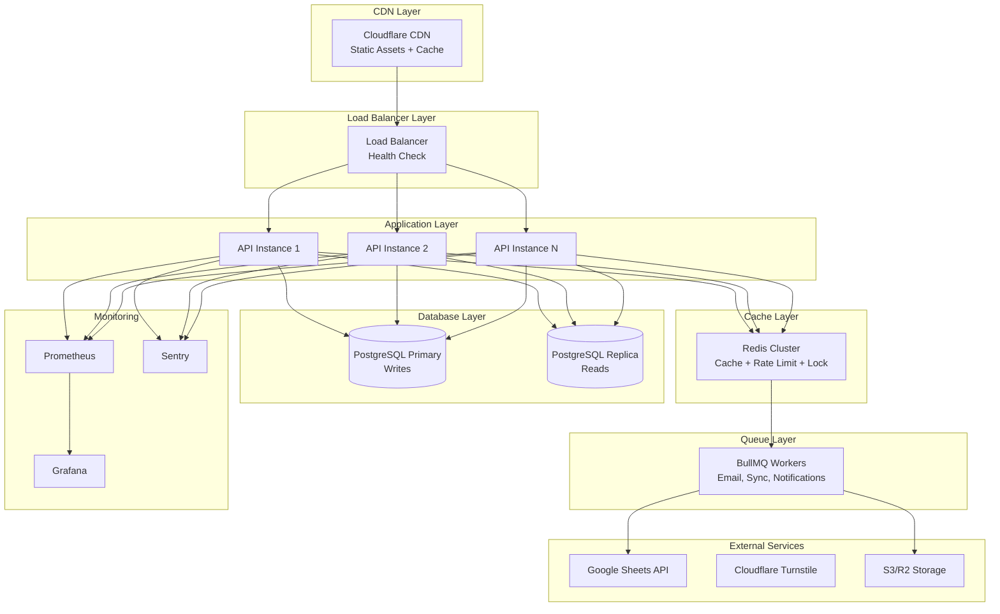

# Design Document: High Traffic Resilience

## Overview

Tài liệu này mô tả thiết kế chi tiết để nâng cao khả năng chịu tải và phục hồi của hệ thống ANH THỢ XÂY. Thiết kế tập trung vào việc đảm bảo hệ thống có thể:

1. **Scale horizontally** - Chạy nhiều instances song song
2. **Fail gracefully** - Xử lý lỗi không làm sập toàn bộ hệ thống
3. **Recover quickly** - Phục hồi nhanh sau sự cố
4. **Monitor effectively** - Theo dõi và cảnh báo kịp thời

### Design Principles

- **Stateless by default**: API không lưu state trong memory
- **Fail fast**: Timeout và circuit breaker để tránh cascade failures
- **Graceful degradation**: Fallback khi dependencies fail
- **Observable**: Metrics, logs, traces cho mọi operation

## Architecture



## Components and Interfaces

### 1. Stateless API Layer

```typescript
// api/src/config/cluster.ts
interface ClusterConfig {
  instanceId: string;           // Unique instance identifier
  healthCheckPath: string;      // /health/ready
  shutdownTimeout: number;      // 30000ms
  drainTimeout: number;         // 25000ms
}

// Shared state via Redis
interface SharedState {
  rateLimits: RedisRateLimiter;
  cache: RedisCache;
  locks: Redlock;
  sessions: RedisSessionStore;
}
```

### 2. CDN Integration

```typescript
// api/src/middleware/cdn-headers.ts
interface CDNHeadersConfig {
  staticAssetMaxAge: number;    // 31536000 (1 year)
  apiCacheMaxAge: number;       // 300 (5 minutes)
  cdnDomain: string;            // From env CDN_DOMAIN
  purgeApiKey: string;          // From env CDN_PURGE_API_KEY
}

// Cache-Control header patterns
const cachePatterns = {
  immutable: 'public, max-age=31536000, immutable',
  publicApi: 'public, s-maxage=300, stale-while-revalidate=60',
  private: 'private, no-cache, no-store',
  noStore: 'no-store'
};
```

### 3. Database Read Replica

```typescript
// api/src/utils/prisma-replica.ts
interface PrismaReplicaConfig {
  primaryUrl: string;           // DATABASE_URL
  replicaUrl?: string;          // DATABASE_REPLICA_URL
  maxReplicationLag: number;    // 5000ms
}

interface QueryRouter {
  // Route read queries to replica
  read<T>(query: () => Promise<T>): Promise<T>;
  // Route write queries to primary
  write<T>(query: () => Promise<T>): Promise<T>;
  // Force primary for critical reads
  readPrimary<T>(query: () => Promise<T>): Promise<T>;
}
```

### 4. Health Check System

```typescript
// api/src/routes/health.routes.ts
interface HealthStatus {
  status: 'healthy' | 'degraded' | 'unhealthy';
  checks: {
    database: HealthCheck;
    redis: HealthCheck;
    queue: HealthCheck;
  };
  uptime: number;
  version: string;
}

interface HealthCheck {
  status: 'up' | 'down' | 'degraded';
  latency?: number;
  message?: string;
}
```

### 5. Graceful Shutdown Manager

```typescript
// api/src/utils/shutdown.ts
interface ShutdownManager {
  // Register cleanup handlers
  onShutdown(handler: () => Promise<void>): void;
  // Start shutdown sequence
  initiateShutdown(signal: string): Promise<void>;
  // Check if shutting down
  isShuttingDown(): boolean;
}

interface ShutdownConfig {
  timeout: number;              // 30000ms
  drainDelay: number;           // 5000ms (wait for LB to stop routing)
  forceExitDelay: number;       // 35000ms
}
```

### 6. Secret Rotation Service

```typescript
// api/src/services/secret-rotation.service.ts
interface SecretRotationConfig {
  jwtSecrets: string[];         // [current, previous]
  encryptionKeys: string[];     // [current, previous]
  gracePeriod: number;          // 86400000 (24 hours)
}

interface SecretRotationService {
  // Validate token with multiple secrets
  validateJwt(token: string): JwtPayload | null;
  // Encrypt with current key
  encrypt(data: string): string;
  // Decrypt with any valid key
  decrypt(encrypted: string): string;
  // Re-encrypt data with new key
  reEncrypt(encrypted: string): string;
}
```

### 7. Load Testing Scripts

```typescript
// scripts/load-test/scenarios.ts
interface LoadTestScenario {
  name: string;
  vus: number;                  // Virtual users
  duration: string;             // '5m', '30m'
  stages?: Stage[];
  thresholds: Thresholds;
}

interface Thresholds {
  http_req_duration: string[];  // ['p(95)<500', 'p(99)<1000']
  http_req_failed: string[];    // ['rate<0.01']
  http_reqs: string[];          // ['rate>100']
}
```

### 8. Redis Cluster Client

```typescript
// api/src/config/redis-cluster.ts
interface RedisClusterConfig {
  mode: 'single' | 'cluster';
  nodes?: string[];             // For cluster mode
  url?: string;                 // For single mode
  retryStrategy: RetryStrategy;
  fallbackToMemory: boolean;
}

interface RedisClusterClient {
  get(key: string): Promise<string | null>;
  set(key: string, value: string, ttl?: number): Promise<void>;
  del(key: string): Promise<void>;
  // Cluster-aware operations
  mget(keys: string[]): Promise<(string | null)[]>;
  pipeline(): Pipeline;
}
```

### 9. Request Timeout Manager

```typescript
// api/src/middleware/timeout.ts
interface TimeoutConfig {
  default: number;              // 30000ms
  database: number;             // 10000ms
  external: number;             // 15000ms
  healthCheck: number;          // 100ms
}

interface TimeoutMiddleware {
  // Wrap handler with timeout
  withTimeout<T>(
    handler: () => Promise<T>,
    timeout: number,
    context: string
  ): Promise<T>;
}
```

### 10. Correlation ID Propagation

```typescript
// api/src/middleware/correlation-id.ts
interface CorrelationContext {
  correlationId: string;
  parentId?: string;
  spanId: string;
}

interface CorrelationPropagator {
  // Extract from incoming request
  extract(headers: Headers): CorrelationContext;
  // Inject into outgoing request
  inject(context: CorrelationContext): Headers;
  // Create child context
  createChild(parent: CorrelationContext): CorrelationContext;
}
```

### 11. IP Blocking Service

```typescript
// api/src/services/ip-blocking.service.ts
interface IPBlockingConfig {
  threshold: number;            // 50 violations
  window: number;               // 300000ms (5 minutes)
  blockDuration: number;        // 3600000ms (1 hour)
}

interface IPBlockingService {
  // Check if IP is blocked
  isBlocked(ip: string): Promise<boolean>;
  // Record rate limit violation
  recordViolation(ip: string): Promise<void>;
  // Block IP manually
  blockIP(ip: string, reason: string, duration?: number): Promise<void>;
  // Unblock IP
  unblockIP(ip: string): Promise<void>;
  // Get blocked IPs list
  getBlockedIPs(): Promise<BlockedIP[]>;
}

interface BlockedIP {
  ip: string;
  reason: string;
  blockedAt: Date;
  expiresAt: Date;
  violationCount: number;
}
```

### 12. Configuration Hot Reload

```typescript
// api/src/config/hot-reload.ts
interface HotReloadConfig {
  pollInterval: number;         // 30000ms
  configSources: ConfigSource[];
}

interface ConfigSource {
  type: 'redis' | 'database' | 'file';
  key: string;
  validator: (config: unknown) => boolean;
}

interface HotReloadService {
  // Get current config value
  get<T>(key: string): T;
  // Subscribe to config changes
  onChange(key: string, handler: (value: unknown) => void): void;
  // Trigger manual reload
  reload(): Promise<void>;
}
```

### 13. SLO Monitoring Service

```typescript
// api/src/services/slo.service.ts
interface SLOConfig {
  availability: {
    target: number;             // 0.999 (99.9%)
    window: number;             // 2592000000 (30 days)
  };
  latency: {
    p99Target: number;          // 500ms
    p95Target: number;          // 200ms
  };
}

interface SLOService {
  // Record request outcome
  recordRequest(success: boolean, latency: number): void;
  // Get current SLO status
  getStatus(): SLOStatus;
  // Get error budget remaining
  getErrorBudget(): ErrorBudget;
}

interface SLOStatus {
  availability: number;
  p99Latency: number;
  p95Latency: number;
  errorBudgetRemaining: number;
  isHealthy: boolean;
}
```

## Data Models

### Configuration Storage (Redis)

```typescript
// Hot-reloadable configuration
interface RuntimeConfig {
  rateLimits: {
    global: { maxAttempts: number; windowMs: number };
    login: { maxAttempts: number; windowMs: number };
    leads: { maxAttempts: number; windowMs: number };
  };
  featureFlags: {
    enableReadReplica: boolean;
    enableIPBlocking: boolean;
    emergencyMode: boolean;
  };
  cacheTTL: {
    categories: number;
    materials: number;
    settings: number;
    regions: number;
  };
}
```

### Blocked IP Storage (Redis)

```typescript
// Key: blocked_ip:{ip}
interface BlockedIPRecord {
  ip: string;
  reason: string;
  blockedAt: number;            // Unix timestamp
  expiresAt: number;            // Unix timestamp
  violationCount: number;
  blockedBy?: string;           // Admin ID if manual
}

// Key: ip_violations:{ip}
// Type: Sorted Set with timestamp as score
```

### SLO Metrics Storage (Redis)

```typescript
// Key: slo:requests:{date}
interface DailyRequestMetrics {
  total: number;
  successful: number;
  failed: number;
  latencySum: number;
  latencyP99: number;
  latencyP95: number;
}

// Key: slo:availability:30d
// Type: Rolling window of daily availability
```

## Correctness Properties

*A property is a characteristic or behavior that should hold true across all valid executions of a system-essentially, a formal statement about what the system should do. Properties serve as the bridge between human-readable specifications and machine-verifiable correctness guarantees.*

### Property 1: Stateless Consistency
*For any* valid JWT token, if it validates successfully on instance A, then it SHALL validate successfully on instance B with the same result.
**Validates: Requirements 1.1, 1.2**

### Property 2: Cache Header Consistency
*For any* HTTP response from a public endpoint, the response SHALL include appropriate Cache-Control headers matching the endpoint type (static asset, public API, or private).
**Validates: Requirements 2.1, 2.2, 2.5**

### Property 3: Query Routing Correctness
*For any* database query, read-only queries SHALL route to replica (if configured) and write queries SHALL always route to primary.
**Validates: Requirements 3.1, 3.2, 3.6**

### Property 4: Health Check Response Time
*For any* health check request to /health/live or /health/ready, the response time SHALL be less than 100ms.
**Validates: Requirements 4.5**

### Property 5: Secret Rotation Round-Trip
*For any* data encrypted with the previous encryption key, decryption with the current key set (containing both current and previous keys) SHALL produce the original data.
**Validates: Requirements 6.1, 6.2**

### Property 6: Correlation ID Propagation
*For any* request with X-Request-ID header, all downstream operations (logs, external calls, queue jobs, error responses) SHALL include the same correlation ID.
**Validates: Requirements 10.1, 10.3, 10.4, 10.5**

### Property 7: IP Blocking Enforcement
*For any* IP address that exceeds the rate limit threshold (50 violations in 5 minutes), subsequent requests from that IP SHALL receive 403 Forbidden response.
**Validates: Requirements 14.1, 14.2**

### Property 8: Configuration Validation
*For any* configuration change, the system SHALL validate the new configuration against the schema before applying, and SHALL reject invalid configurations.
**Validates: Requirements 15.4, 15.5**

### Property 9: Redis Fallback Non-Blocking
*For any* Redis operation failure, the main request flow SHALL complete without blocking, using in-memory fallback if available.
**Validates: Requirements 8.6**

### Property 10: Availability Calculation
*For any* time window, the calculated availability SHALL equal (successful_requests / total_requests) with precision of at least 4 decimal places.
**Validates: Requirements 13.1, 13.5**

### Property 11: Content Hash Determinism
*For any* file content, the generated filename hash SHALL be deterministic (same content produces same hash).
**Validates: Requirements 2.3**

## Error Handling

### Error Categories

| Category | HTTP Status | Retry | Circuit Breaker |
|----------|-------------|-------|-----------------|
| Validation Error | 400 | No | No |
| Authentication Error | 401 | No | No |
| Authorization Error | 403 | No | No |
| Not Found | 404 | No | No |
| Rate Limited | 429 | Yes (backoff) | No |
| IP Blocked | 403 | No | No |
| Timeout | 504 | Yes (once) | Yes |
| Service Unavailable | 503 | Yes (backoff) | Yes |
| Internal Error | 500 | Yes (once) | Yes |

### Error Response Format

```typescript
interface ErrorResponse {
  success: false;
  error: {
    code: string;               // RATE_LIMITED, IP_BLOCKED, TIMEOUT, etc.
    message: string;
    details?: Record<string, unknown>;
    retryAfter?: number;        // Seconds until retry allowed
  };
  correlationId: string;
}
```

### Fallback Strategies

```typescript
// Redis unavailable
const redisFallback = {
  cache: 'in-memory with reduced TTL',
  rateLimit: 'in-memory per-instance',
  lock: 'skip locking with warning',
  session: 'reject with 503'
};

// Database replica unavailable
const replicaFallback = {
  reads: 'route to primary',
  alert: 'log warning and notify'
};

// External service unavailable
const externalFallback = {
  googleSheets: 'queue for retry',
  turnstile: 'allow with warning in dev, reject in prod'
};
```

## Testing Strategy

### Dual Testing Approach

Hệ thống sử dụng cả unit tests và property-based tests:

- **Unit tests**: Kiểm tra specific examples, edge cases, error conditions
- **Property tests**: Kiểm tra universal properties across all inputs

### Property-Based Testing Framework

Sử dụng **fast-check** cho TypeScript property-based testing.

```typescript
import fc from 'fast-check';

// Example: Test stateless consistency
fc.assert(
  fc.property(
    fc.string(), // JWT token
    fc.integer({ min: 1, max: 10 }), // Instance ID
    (token, instanceId) => {
      const result1 = validateToken(token, instanceId);
      const result2 = validateToken(token, instanceId + 1);
      return result1 === result2;
    }
  ),
  { numRuns: 100 }
);
```

### Test Categories

1. **Stateless Tests**
   - JWT validation across instances
   - Cache consistency
   - Rate limit state sharing

2. **Resilience Tests**
   - Redis failure fallback
   - Database replica failover
   - Circuit breaker behavior

3. **Performance Tests**
   - Health check response time
   - Timeout enforcement
   - Connection draining

4. **Security Tests**
   - IP blocking enforcement
   - Secret rotation
   - Configuration validation

### Load Testing with k6

```javascript
// scripts/load-test/baseline.js
import http from 'k6/http';
import { check, sleep } from 'k6';

export const options = {
  vus: 100,
  duration: '5m',
  thresholds: {
    http_req_duration: ['p(95)<500', 'p(99)<1000'],
    http_req_failed: ['rate<0.01'],
  },
};

export default function () {
  // Simulate realistic user flow
  const responses = http.batch([
    ['GET', `${BASE_URL}/api/regions`],
    ['GET', `${BASE_URL}/service-categories`],
    ['GET', `${BASE_URL}/materials`],
  ]);
  
  check(responses[0], {
    'regions status 200': (r) => r.status === 200,
  });
  
  sleep(1);
}
```

### Test Annotations

Mỗi property-based test PHẢI được annotate với format:
```typescript
/**
 * **Feature: high-traffic-resilience, Property 1: Stateless Consistency**
 * **Validates: Requirements 1.1, 1.2**
 */
```

