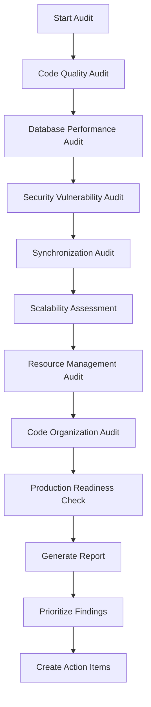
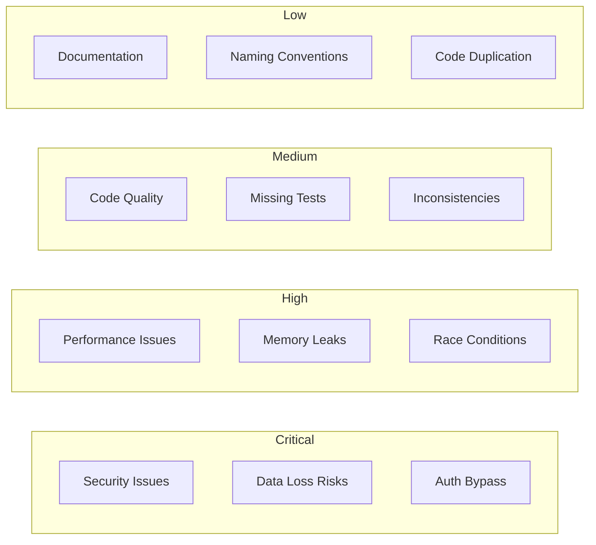

# Design Document: Scalability Audit

## Overview

Tài liệu này mô tả thiết kế cho việc audit toàn diện codebase ANH THỢ XÂY, đánh giá chất lượng code, hiệu năng database, bảo mật, và khả năng scale của hệ thống.

### Current Architecture Summary

```
┌─────────────────────────────────────────────────────────────────┐
│                        CURRENT STACK                             │
├─────────────────────────────────────────────────────────────────┤
│  Frontend Apps                                                   │
│  ├── Landing (React + Vite) - Port 4200                         │
│  ├── Admin (React + Vite) - Port 4201                           │
│  └── Portal (React + Vite) - Port 4203                          │
├─────────────────────────────────────────────────────────────────┤
│  Backend API                                                     │
│  └── Hono (Node.js) - Port 4202                                 │
│      ├── JWT Authentication                                      │
│      ├── Rate Limiting (In-Memory)                              │
│      ├── Zod Validation                                         │
│      └── Prisma ORM                                             │
├─────────────────────────────────────────────────────────────────┤
│  Database                                                        │
│  └── SQLite (Single File)                                       │
├─────────────────────────────────────────────────────────────────┤
│  Shared Packages                                                 │
│  ├── @app/shared (Config, Tokens, Utils)                        │
│  └── @app/ui (UI Components)                                    │
└─────────────────────────────────────────────────────────────────┘
```

### Scalability Gap Analysis

| Feature | Current State | Enterprise Standard | Gap |
|---------|--------------|---------------------|-----|
| Architecture | Monolith | Microservices | High |
| Load Balancing | None | Nginx/HAProxy/ELB | High |
| Caching | None | Redis/Memcached | High |
| Message Queue | None | RabbitMQ/Kafka | Medium |
| Database | SQLite (single file) | PostgreSQL + Read Replicas | High |
| Rate Limiting | In-Memory | Redis-based | Medium |
| Session Storage | Database | Redis | Low |
| File Storage | Local | S3/CloudFront | Medium |

## Architecture

### Audit Execution Flow



### Audit Categories



## Components and Interfaces

### 1. Code Quality Analyzer

```typescript
interface CodeQualityFinding {
  category: 'AUTH_MISSING' | 'N_PLUS_1' | 'ERROR_HANDLING' | 'TYPE_SAFETY' | 'VALIDATION';
  severity: 'CRITICAL' | 'HIGH' | 'MEDIUM' | 'LOW';
  file: string;
  line?: number;
  description: string;
  recommendation: string;
}
```

### 2. Database Performance Analyzer

```typescript
interface DatabaseFinding {
  category: 'MISSING_INDEX' | 'NO_TRANSACTION' | 'UNBOUNDED_QUERY' | 'OVER_FETCH' | 'RACE_CONDITION';
  severity: 'CRITICAL' | 'HIGH' | 'MEDIUM' | 'LOW';
  table: string;
  query?: string;
  description: string;
  recommendation: string;
}
```

### 3. Security Analyzer

```typescript
interface SecurityFinding {
  category: 'AUTH' | 'AUTHZ' | 'DATA_EXPOSURE' | 'RATE_LIMIT' | 'INPUT_SANITIZATION';
  severity: 'CRITICAL' | 'HIGH' | 'MEDIUM' | 'LOW';
  endpoint?: string;
  description: string;
  recommendation: string;
  cweId?: string; // Common Weakness Enumeration
}
```

### 4. Scalability Assessor

```typescript
interface ScalabilityFinding {
  category: 'STATEFUL' | 'NO_CACHE' | 'SYNC_BLOCKING' | 'DB_BOTTLENECK';
  impact: 'BLOCKING' | 'DEGRADED' | 'ACCEPTABLE';
  component: string;
  currentCapacity: string;
  targetCapacity: string;
  recommendation: string;
}
```

## Data Models

### Audit Report Structure

```typescript
interface AuditReport {
  id: string;
  generatedAt: Date;
  version: string;
  
  summary: {
    totalFindings: number;
    critical: number;
    high: number;
    medium: number;
    low: number;
    passedChecks: number;
  };
  
  sections: {
    codeQuality: CodeQualityFinding[];
    database: DatabaseFinding[];
    security: SecurityFinding[];
    synchronization: SyncFinding[];
    scalability: ScalabilityFinding[];
    resources: ResourceFinding[];
    organization: OrganizationFinding[];
    production: ProductionFinding[];
  };
  
  recommendations: PrioritizedRecommendation[];
}
```

### Finding Priority Matrix

| Severity | Impact | Priority | Action Timeline |
|----------|--------|----------|-----------------|
| CRITICAL | Security/Data Loss | P0 | Immediate |
| HIGH | Performance/Stability | P1 | This Sprint |
| MEDIUM | Quality/Maintainability | P2 | Next Sprint |
| LOW | Best Practice | P3 | Backlog |

## Correctness Properties

*A property is a characteristic or behavior that should hold true across all valid executions of a system-essentially, a formal statement about what the system should do. Properties serve as the bridge between human-readable specifications and machine-verifiable correctness guarantees.*

### Property 1: Sensitive Data Exclusion
*For any* API response containing user data, the response SHALL NOT include passwordHash, tokenSelector, tokenVerifier, or any token-related fields.
**Validates: Requirements 3.3**

### Property 2: Error Response Format Consistency
*For any* error response from the API, the response SHALL have the format `{ success: false, error: { code: string, message: string }, correlationId: string }`.
**Validates: Requirements 4.3**

### Property 3: Authenticated Endpoint Protection
*For any* endpoint under `/api/admin/*`, `/api/homeowner/*`, `/api/contractor/*`, the endpoint SHALL require valid JWT authentication.
**Validates: Requirements 3.2**

### Property 4: Pagination Bounds
*For any* list endpoint returning paginated data, the response SHALL include meta with total, page, limit, and totalPages fields.
**Validates: Requirements 6.5**

## Error Handling

### Audit Error Categories

| Error Type | Handling Strategy |
|------------|-------------------|
| File Not Found | Skip with warning, continue audit |
| Parse Error | Log error, mark file as unaudited |
| Permission Denied | Escalate to user |
| Timeout | Retry once, then skip |

## Testing Strategy

### Dual Testing Approach

1. **Unit Tests**: Verify specific audit checks work correctly
2. **Property-Based Tests**: Verify audit properties hold across codebase

### Property-Based Testing Library
- **Library**: fast-check (already in devDependencies)
- **Minimum Iterations**: 100 per property test

### Test Categories

1. **Security Property Tests**
   - Verify no sensitive data in responses
   - Verify auth middleware presence
   - Verify rate limiting configuration

2. **Consistency Property Tests**
   - Verify error response format
   - Verify pagination format
   - Verify status enum values

3. **Resource Management Tests**
   - Verify Prisma singleton usage
   - Verify stream cleanup
   - Verify connection management

---

## Preliminary Findings (Based on Code Review)

### Critical Findings

#### 1. Multiple PrismaClient Instantiations
**Severity**: HIGH
**Location**: 
- `api/src/main.ts` (line 114)
- `api/src/utils/prisma.ts` (line 4)
- `api/src/services/google-sheets.service.ts` (line 13)

**Issue**: Multiple PrismaClient instances can exhaust database connections.
**Recommendation**: Use singleton pattern from `utils/prisma.ts` everywhere.

#### 2. In-Memory Rate Limiting
**Severity**: MEDIUM
**Location**: `api/src/middleware/rate-limiter.ts`

**Issue**: Rate limit store is in-memory, won't work with multiple server instances.
**Recommendation**: Migrate to Redis-based rate limiting for horizontal scaling.

#### 3. SQLite Database
**Severity**: HIGH (for scaling)
**Location**: `infra/prisma/schema.prisma`

**Issue**: SQLite is single-file, single-writer, not suitable for production scale.
**Recommendation**: Migrate to PostgreSQL for production.

### High Priority Findings

#### 4. Unbounded Queries in Dashboard Service
**Severity**: MEDIUM
**Location**: `api/src/services/dashboard.service.ts`

**Issue**: Multiple `findMany` without pagination for stats calculation.
**Recommendation**: Use aggregation queries or add limits.

#### 5. Missing Graceful Shutdown
**Severity**: MEDIUM
**Location**: `api/src/main.ts`

**Issue**: No SIGTERM handler for graceful shutdown.
**Recommendation**: Add shutdown handler to close database connections.

### Scalability Recommendations

#### Phase 1: Quick Wins (1-2 weeks)
1. Fix PrismaClient singleton usage
2. Add graceful shutdown handler
3. Add database connection pooling config
4. Optimize dashboard queries with aggregations

#### Phase 2: Production Readiness (1 month)
1. Migrate from SQLite to PostgreSQL
2. Implement Redis for rate limiting
3. Add Redis for session caching
4. Set up proper logging infrastructure

#### Phase 3: Scale Preparation (2-3 months)
1. Implement Redis caching for frequently accessed data
2. Add message queue for async operations (email, notifications)
3. Set up CDN for static assets
4. Implement database read replicas

#### Phase 4: Enterprise Scale (6+ months)
1. Break into microservices (Auth, Projects, Bids, Notifications)
2. Implement service mesh
3. Add distributed tracing
4. Set up auto-scaling infrastructure
